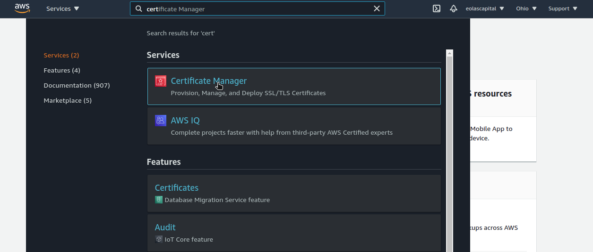
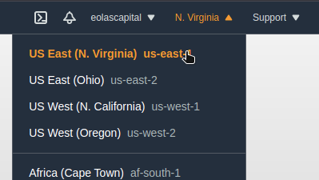
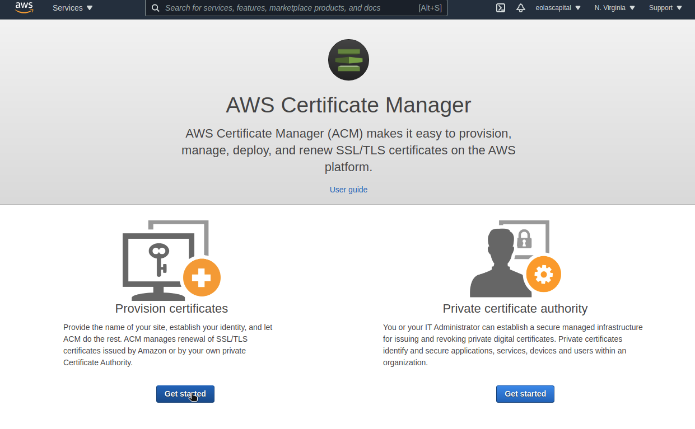

# Certificate Creation

Inside AWS we’re able to create and manage SSL certificates to be used by our applications, for this we use AWS Certificate Manager. Here we’ll cover creating a new certificate where AWS will be the issuer of the certificate, if you need to import a certificate it’s a different procedure. 

To start we need to navigate to `Certificate Manager` in our AWS account.

Now we need to make sure that we’re in the correct AWS region, this will depend on the requirements of our certificate.

It’s important to note that certificates can be created in different AWS regions, some applications will only be able to access certificates created in their regions, like ElasticBeanstalk, and others like Cloudfront can only access certificates created in `us-east-1` so you might need to create your certificates in multiple regions for your app to be completely covered.

Once we are in Certificate Manager and int he AWS region we’ll be working on we can go ahead and create a new Certificate. For this we’ll click on the `Get Started` button in the `Provision certificates` section.

In the next step we need to select `Request a public certificate` and then click on `Request certificate`.

In the next step we’ll be adding the domain names that we’ll be using in our certificate, we usually want to create a wildcard certificate (for definition see this [article](https://en.wikipedia.org/wiki/Wildcard_certificate)) so we can cover any services we create in the future. We always need to add out base domain and then our wildcard value, so we would have something like:

- `yourdomain.com`
- `*.yourdomain.com`

Once we have added this values we can click on `Next`.

In some cases you might be asked for a validation type in case you do, we always want to do DNS based validation.

In the next section we can add tags to our certificate, it’s not a necessary step to continue. Once we’re done with this step we can click on `Review`. 

Now we can review all the configurations for our certificate, and we need to make sure we’re covering the domains & subdomains that we need our certificate for. When we’re ready we can click on `Request` to continue.

Now we’ve created our certificate, but it’s not issued yet. To issue the certificate we need to create some DNS records, for this guide we’ll assume that your domain is managed by Route53. If your domain is managed by another registrar you’ll need to follow different steps to create the DNS records. 

To create DNS validation records in Route53 we just need to open each domain name and click on the `Create record in Route53`. This will confirm and create all the necessary records in our DNS management for us. Once we’re done with all domain names we can click `Create records`.

Usually Route53 is very fast to validate records with AWS Certificate Manager so in most situations in the next step we should see the certificate as issued. In case you don’t see this just reload this page after a couple of minutes to refresh it’s status.

Once the certificate is shown as `Issued` it means that it’s ready to be used by our applications in AWS.

