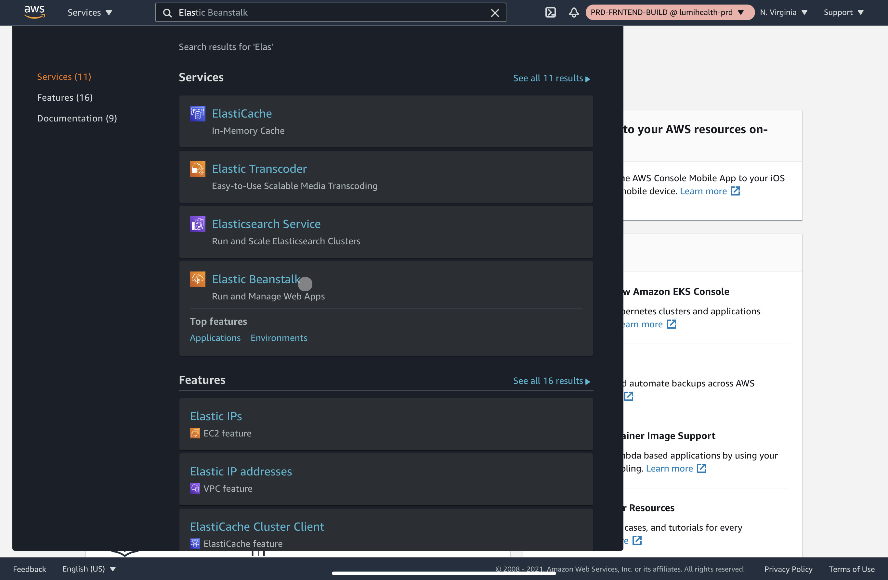
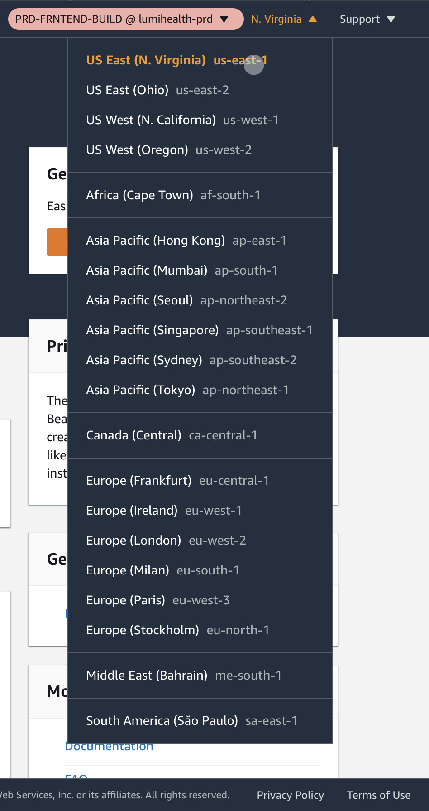
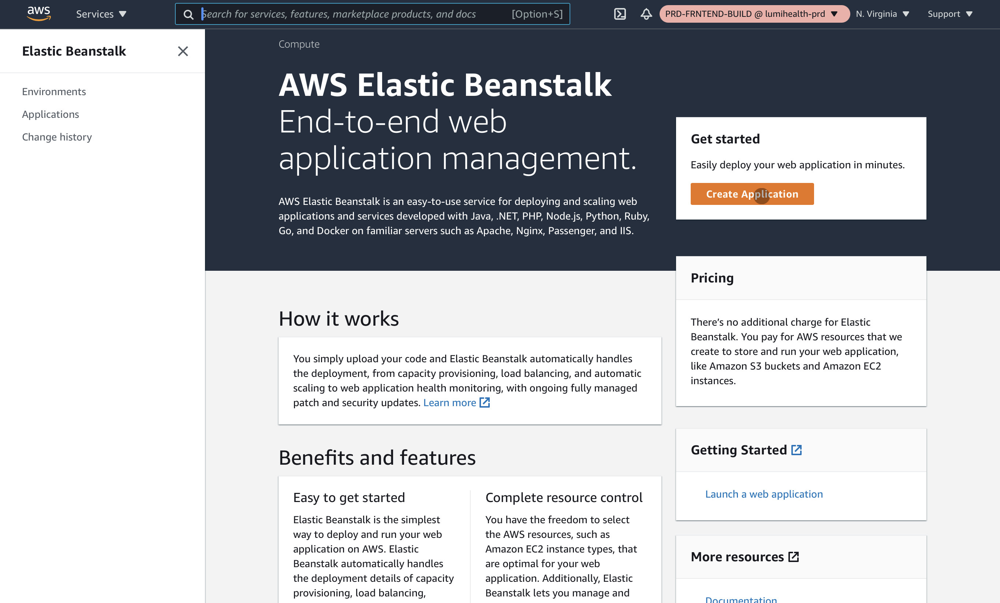
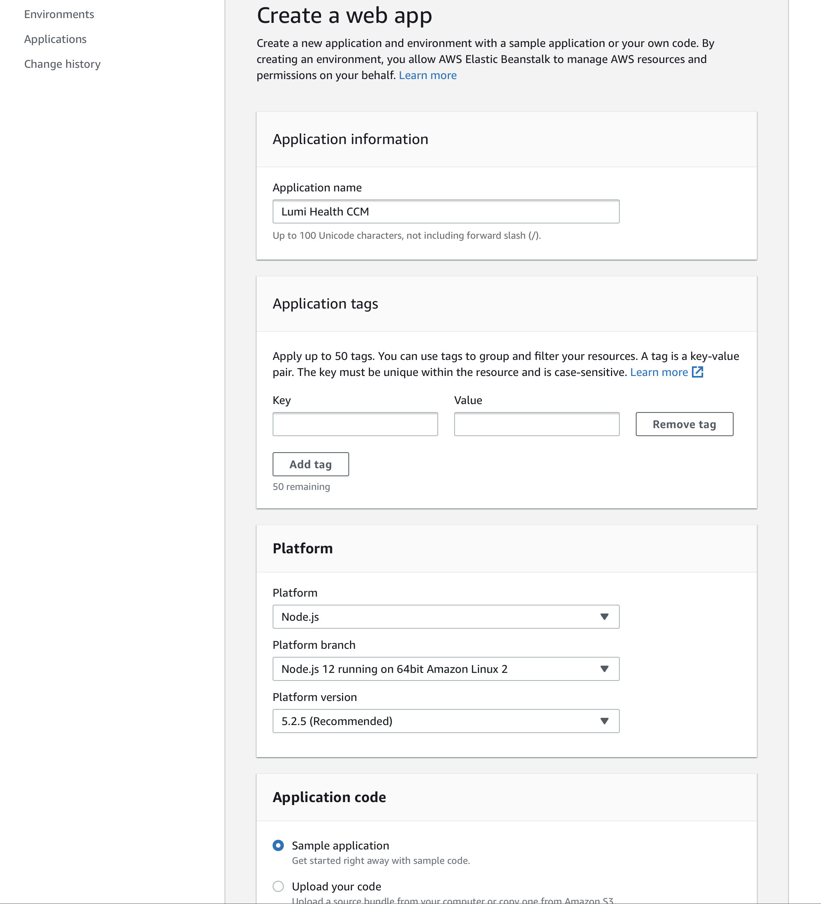
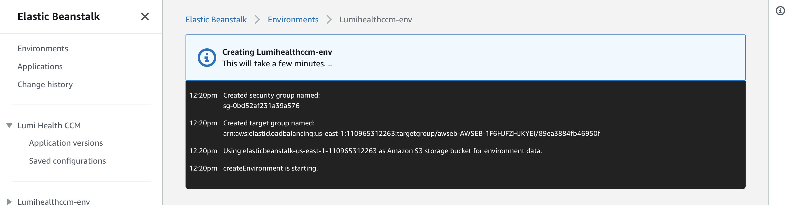

# Application Creation

For deploying a backend application we can use Elastic Beanstalk to create an auto-managed application that will take care load balancing and auto scaling using EC2 and ELB. To start this process we can go to the `Elastic Beanstalk` application in our AWS account.

Once we are in our application we need to make sure we’re in the AWS region we want to work in, this will be important as an EB application needs a matching ACM certificate in it’s region to be used with a custom domain using https.

Once we’re inside Elastic Beanstalk and in the region we want to work in, we can go ahead and get started by clicking on `Create Application`.

In the next step we need to define the configurations for our project. First we’ll setup the name of our Project and then we need to setup the platform. In some cases where we have a docker configuration we can use a docker platform but in most cases we’ll be using `Node.js` for the Platform and the latest version of Node available as Platform branch and version. Then we want to deploy the application with some sample code as this will be the easiest to make sure the deployment is working and we’ll overwrite this code anyways when we do our first deployment.

Once we’ve set all the configurations and we’ve reviewed them we can go ahead and create the application.

Now that the application is created, it will create an environment for us automatically. We’ll remove this environment soon as it won’t have the naming conventions we need but it is important to note that every new EB application creates a sample environment.

> In an EB application we can have any number of environments that translate to different applications. We usually use this to define environments like `production` or `development` and they are usually linked to specific branches in our git flow.

As explained above, once the environment has completed being created we’ll need to go into `Actions` and click on `Terminate environment`.

.jpg)

We need to confirm that we want to terminate this environment.

Once the environment termination is completed we now have an Elastic Beanstalk Application that we can go ahead and start setting up.

