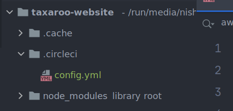
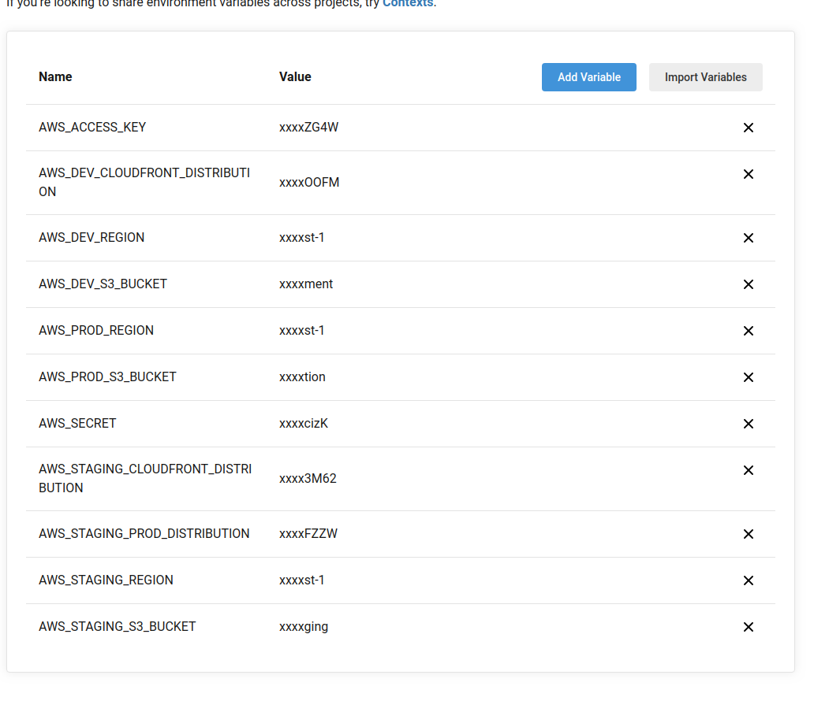
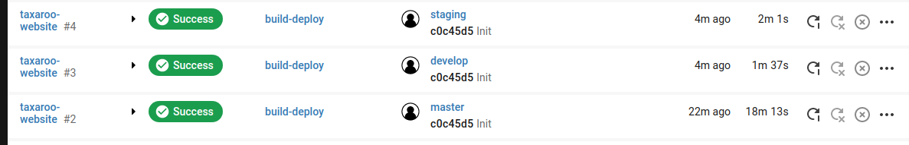

# Circle CI [BE]

## Circle CI Configuration

Once we have our environment setup we need to add CircleCI config files for our repository. Go ahead and create a new branch for this task and once you’re ready create a new folder at the root of the repository called `.circleci` and create a file inside called `config.yml`


The contents of this file will vary slightly depending on the requirements for the project, if we have staging environment or not and if we will have Carbon Builds or not.

Here’s the configuration file for a full setup with all 3 environments

> info
>
> ``` 
> version: 2
> jobs:
>   SonarScan:
>     docker:
>       - image: sonarsource/sonar-scanner-cli
>     working_directory: ~/repo
>     steps:
>       - checkout
>       - run:
>           name: Create SonarQube Properties
>           command: |
>             printenv
>   DeployDev:
>     environment:
>       NODE_ENV: development
>     docker:
>       # specify the version you desire here
>       - image: nikolaik/python-nodejs:latest
>       # Specify service dependencies here if necessary
>       # CircleCI maintains a library of pre-built images
>       # documented at https://circleci.com/docs/2.0/circleci-images/
>       # - image: circleci/mongo:3.4.4
>     working_directory: ~/repo
>     steps:
>       - checkout
>       - run:
>           name: Install AWS CLI
>           command: |
>             curl "https://awscli.amazonaws.com/awscli-exe-linux-x86_64.zip" -o "awscliv2.zip"
>             unzip awscliv2.zip
>             ./aws/install -i /usr/local/aws-cli -b /usr/local/bin
>             aws --version
>       - run:
>           name: Install EB CLI
>           command: |
>             apt install python3.7
>             python3 --version
>             curl -O https://bootstrap.pypa.io/get-pip.py
>             python3 get-pip.py --user
>             pip install awsebcli --upgrade --user
>             echo 'export PATH="~/.local/bin:$PATH"' >> $BASH_ENV
>             source $BASH_ENV
>             eb --version
>       - run:
>           name: Setup AWS credentials
>           command: |
>             mkdir ~/.aws
>             touch ~/.aws/config
>             chmod 600 ~/.aws/config
>             echo "[profile default]" > ~/.aws/config
>             echo "aws_access_key_id=${AWS_ACCESS_KEY}" >> ~/.aws/config
>             echo "aws_secret_access_key=${AWS_SECRET}" >> ~/.aws/config
>       # Download and cache dependencies
>       - restore_cache:
>           keys:
>             - v1-dependencies-{{ checksum "package.json" }}
>             # fallback to using the latest cache if no exact match is found
>             - v1-dependencies-
>       - run:
>           name: Install Dependencies
>           command: |
>             cat package.json
>             npm install --unsafe-perm=true --allow-root
>             npm run build --unsafe-perm=true --allow-root
>       - save_cache:
>           paths:
>             - node_modules
>           key: v1-dependencies-{{ checksum "package.json" }}
>       # run tests!
>       # - run: yarn test
>       - run:
>           name: Deploying to AWS Elastic Beanstalk
>           no_output_timeout: 30m
>           command: |
>             eb use TaxarooApiV2-develop-env --profile default --region ${AWS_DEV_REGION} && eb deploy -v --staged --profile default --region ${AWS_DEV_REGION} --timeout 30 --verbose
>   DeployStaging:
>     docker:
>       # specify the version you desire here
>       - image: nikolaik/python-nodejs:latest
>       # Specify service dependencies here if necessary
>       # CircleCI maintains a library of pre-built images
>       # documented at https://circleci.com/docs/2.0/circleci-images/
>       # - image: circleci/mongo:3.4.4
>     working_directory: ~/repo
>     steps:
>       - checkout
>       - run:
>           name: Install AWS CLI
>           command: |
>             curl "https://awscli.amazonaws.com/awscli-exe-linux-x86_64.zip" -o "awscliv2.zip"
>             unzip awscliv2.zip
>             ./aws/install -i /usr/local/aws-cli -b /usr/local/bin
>             aws --version
>       - run:
>           name: Install EB CLI
>           command: |
>             apt install python3.7
>             python3 --version
>             curl -O https://bootstrap.pypa.io/get-pip.py
>             python3 get-pip.py --user
>             pip install awsebcli --upgrade --user
>             echo 'export PATH="~/.local/bin:$PATH"' >> $BASH_ENV
>             source $BASH_ENV
>             eb --version
>       - run:
>           name: Setup AWS credentials
>           command: |
>             mkdir ~/.aws
>             touch ~/.aws/config
>             chmod 600 ~/.aws/config
>             echo "[profile default]" > ~/.aws/config
>             echo "aws_access_key_id=${AWS_ACCESS_KEY}" >> ~/.aws/config
>             echo "aws_secret_access_key=${AWS_SECRET}" >> ~/.aws/config
>       # Download and cache dependencies
>       - restore_cache:
>           keys:
>             - v1-dependencies-{{ checksum "package.json" }}
>             # fallback to using the latest cache if no exact match is found
>             - v1-dependencies-
>       - run:
>           name: Install Dependencies
>           command: |
>             npm install
>       - save_cache:
>           paths:
>             - node_modules
>           key: v1-dependencies-{{ checksum "package.json" }}
>       # run tests!
>       # - run: yarn test
>       - run:
>           name: Deploying to AWS Elastic Beanstalk
>           command: |
>             eb use TaxarooApiV2-staging-env --profile default --region ${AWS_DEV_REGION} && eb deploy -v --staged --profile default --region ${AWS_DEV_REGION}
>   DeployProd:
>     docker:
>       # specify the version you desire here
>       - image: nikolaik/python-nodejs:latest
>       # Specify service dependencies here if necessary
>       # CircleCI maintains a library of pre-built images
>       # documented at https://circleci.com/docs/2.0/circleci-images/
>       # - image: circleci/mongo:3.4.4
>     working_directory: ~/repo
>     steps:
>       - checkout
>       - run:
>           name: Install AWS CLI
>           command: |
>             curl "https://awscli.amazonaws.com/awscli-exe-linux-x86_64.zip" -o "awscliv2.zip"
>             unzip awscliv2.zip
>             ./aws/install -i /usr/local/aws-cli -b /usr/local/bin
>             aws --version
>       - run:
>           name: Install EB CLI
>           command: |
>             apt install python3.7
>             python3 --version
>             curl -O https://bootstrap.pypa.io/get-pip.py
>             python3 get-pip.py --user
>             pip install awsebcli --upgrade --user
>             echo 'export PATH="~/.local/bin:$PATH"' >> $BASH_ENV
>             source $BASH_ENV
>             eb --version
>       - run:
>           name: Setup AWS credentials
>           command: |
>             mkdir ~/.aws
>             touch ~/.aws/config
>             chmod 600 ~/.aws/config
>             echo "[profile default]" > ~/.aws/config
>             echo "aws_access_key_id=${AWS_ACCESS_KEY}" >> ~/.aws/config
>             echo "aws_secret_access_key=${AWS_SECRET}" >> ~/.aws/config
>       # Download and cache dependencies
>       - restore_cache:
>           keys:
>             - v1-dependencies-{{ checksum "package.json" }}
>             # fallback to using the latest cache if no exact match is found
>             - v1-dependencies-
>       - run:
>           name: Install Dependencies
>           command: |
>             cat package.json
>             npm install --unsafe-perm=true --allow-root
>             npm run build --unsafe-perm=true --allow-root
>       - save_cache:
>           paths:
>             - node_modules
>           key: v1-dependencies-{{ checksum "package.json" }}
>       # run tests!
>       # - run: yarn test
>       - run:
>           name: Deploying to AWS Elastic Beanstalk
>           command: |
>             eb use TaxarooApiV2-production-env --profile default --region ${AWS_DEV_REGION} && eb deploy -v --staged --profile default --region ${AWS_DEV_REGION}
>   LintCheck:
>     docker:
>       - image: node:12.19.0
>     working_directory: ~/repo
>     steps:
>       - checkout
>       - run:
>           name: Install Dependencies
>           command: |
>             npm install
>       - run:
>           name: Run JS Lint
>           command: |
>             npm run lint:js
> workflows:
>   version: 2
>   QualityCheck:
>     jobs:
>       - SonarScan:
>           filters:
>             branches:
>               ignore:
>                 - master
>                 - develop
>                 - staging
>       - LintCheck:
>           filters:
>             branches:
>               ignore:
>                 - master
>                 - develop
>                 - staging
>   BuildDeploy:
>     jobs:
>       - CarbonBuild:
>           filters:
>             branches:
>               only:
>                 - /carbon/.*/
>       - DeployDev:
>           requires:
>             - LintCheck
>             - SonarScan
>           filters:
>             branches:
>               only:
>                 - develop
>       - DeployStaging:
>           requires:
>             - LintCheck
>             - SonarScan
>           filters:
>             branches:
>               only:
>                 - staging
>       - DeployProd:
>           requires:
>             - Authorization
>           filters:
>             branches:
>               only:
>                 - master
>       - Authorization:
>           type: approval
>           requires:
>             - LintCheck
>             - SonarScan
>           filters:
>             branches:
>               only:
>                 - master
>       - LintCheck:
>           filters:
>             branches:
>               only:
>                 - master
>                 - develop
>                 - staging
>       - SonarScan:
>           filters:
>             branches:
>               only:
>                 - master
>                 - develop
>                 - staging
> ```

This file contains the following jobs:

- DeployDev
- DeployStaging
- DeployProd

If any of this needs to be removed the `workflows` sections will need to be updated accordingly.

Note that on every job that we run the following step `Deploying to AWS Elastic Beanstalk` we have an application name, we’ll need to replace this for the application name we have for each environment.

After we’ve done this, we will now need to push our code into our branch.

## CircleCI Setup

The next step is setting up CircleCI to build the project for this you’ll need the CircleCI administrator to set up the build process for this repo.

Once the project is set up by your administrator, you need to set up the project’s environment variables inside CircleCI. You can see that in our `config.yml` we have a couple of variables represented by `${MY_VARIABLE}` and we need to create this value.

We now need to go into the project’s settings inside CircleCI and into `Environment Variables` where we need to set up values for the following:

- `AWS_ACCESS_KEY`
- `AWS_SECRET`

Here the credentials for `AWS_ACCESS_KEY` and `AWS_SECRET` will most likely need to be provided by the project’s DevOps admin. 

It is unlikely you’ll need to add additional environment variables in a BE project but in case you need to do so for any reason you can do that here.

The final configuration should look something like this (In the case you don’t use any additional variables you should only have `AWS_ACCESS_KEY` and `AWS_SECRET`):


Once we have this we want to test our new environments.

## Testing Environments

Now that we have all our environments in AWS and our configurations in CircleCI we need to test them, we can now merge our CI branch into develop and monitor the deployment. This should happen automatically, if this happens correctly we want to merge now to staging and finally if requested into master. Take note that master requires a manual authorization for the deployment to go thru.

If all went well we should see something like this under CircleCI’s pipelines for our repository:

