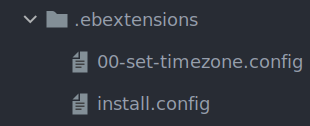

# Elastic Extensions

When you need to create specific configurations to an ElasticBeanstalk application you can create a `.ebextensions` folder at the root of the project. Here you can create small scripts to modify or install additional dependencies to a project.

In general it is good to follow AWS documentation for custom scripts:[https://docs.aws.amazon.com/elasticbeanstalk/latest/dg/ebextensions.html](https://docs.aws.amazon.com/elasticbeanstalk/latest/dg/ebextensions.html) 


Here we’ll cover 4 basic scenarios for ebextension files:

## Setting a Custom Time Zone

> 00-set-timezone.config
>
> ``` 
> commands:
>   set_time_zone:
>     command: ln -f -s /usr/share/zoneinfo/America/New_York /etc/localtime
> ```

## Updating User Permissions (NPM)

> 00-set-permissions.config
>
> ``` 
> files:
>   "/opt/elasticbeanstalk/hooks/appdeploy/post/00_set_tmp_permissions.sh":
>     mode: "000755"
>     owner: root
>     group: root
>     content: |
>       #!/bin/bash
>       chown -R nodejs:nodejs /tmp/.npm
>       chown -R nodejs:nodejs /tmp/.cache
>       chown -R ec2-user:ec2-user /tmp/.npm
>       chown -R ec2-user:ec2-user /tmp/.cache
>       chown -R ec2-user:ec2-user /var/app
> ```


## Installing Custom Packages via YUM

> packages.config
>
> ``` 
> packages:
>   yum:
>     ImageMagick: []
>     git: []
>     cairo: []
>     cairo-devel: []
>     libjpeg-turbo-devel: []
>     giflib-devel: []
>     poppler-utils: []
> ```


## Updating Java Version

> 10_java.config
>
> ``` 
> container_commands:
>     100-remove-old-java:
>         command: "sudo yum remove -y java-1.8.0-openjdk-headless"
>     200-download-rpm-package:
>         command: "wget https://d3pxv6yz143wms.cloudfront.net/11.0.4.11.1/java-11-amazon-corretto-devel-11.0.4.11-1.x86_64.rpm "
>     300-install-java:
>         command: "sudo yum localinstall -y java-11-amazon-corretto-devel-11.0.4.11-1.x86_64.rpm"
> ```


All of the scripts above would be created as a separate file inside the `.ebextensions` folder. Like this:



