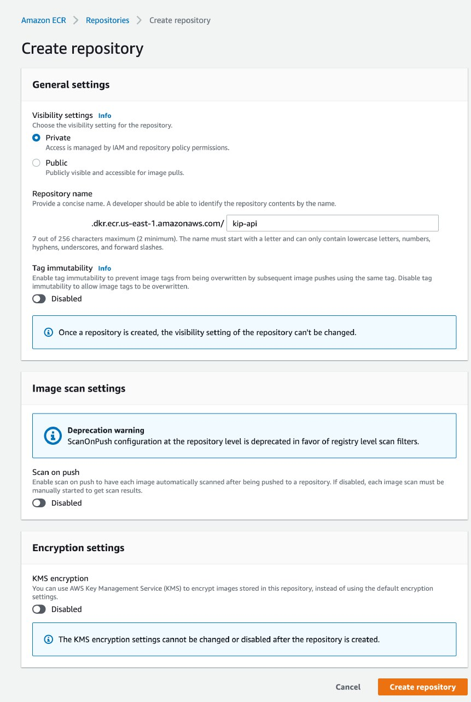
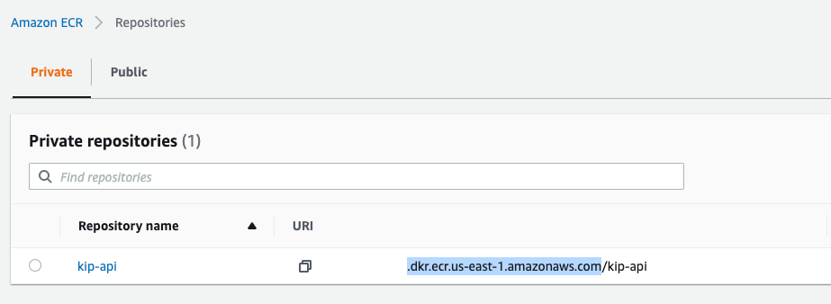

# Amazon Elastic Container Registry (ECR)

Amazon Elastic Container Registry (Amazon ECR) is an AWS-managed container image registry service that is secure, scalable, and reliable. You can use your preferred CLI to push, pull, and manage Docker images, Open Container Initiative (OCI) images, and OCI compatible artifacts.


1. We create a private repository with the name of your application.


2. Go to “Lifecycle policy section“ section and create a rule.
set this configuration and save.
we do this in order to delete old images and keep the repository clean.
3. Copy the URI without the repository name.


4. Use the URI previously copied in CircleCI or directly in the AWS CLI.
Example [CI](https://circleci.com/developer/orbs/orb/circleci/aws-ecr):
```yaml 
ecr_publish:
    parameters:
      tag:
        type: string
      accountUrl:
        type: string
    steps:
      - aws-ecr/build-and-push-image:
          dockerfile: Dockerfile
          account-url: <<parameters.accountUrl>>
          aws-access-key-id: AWS_ACCESS_KEY
          aws-secret-access-key: AWS_SECRET
          repo: ${MY_APP_PREFIX}
          tag: <<parameters.tag>>
```

Example [AWS CLI](https://docs.aws.amazon.com/AmazonECR/latest/userguide/docker-push-ecr-image.html):
``` 
aws ecr get-login-password --region region | docker login --username AWS --password-stdin aws_account_id.dkr.ecr.region.amazonaws.com
docker images
docker tag e9ae3c220b23 aws_account_id.dkr.ecr.region.amazonaws.com/my-repository:tag
docker push aws_account_id.dkr.ecr.region.amazonaws.com/my-repository:tag
```


