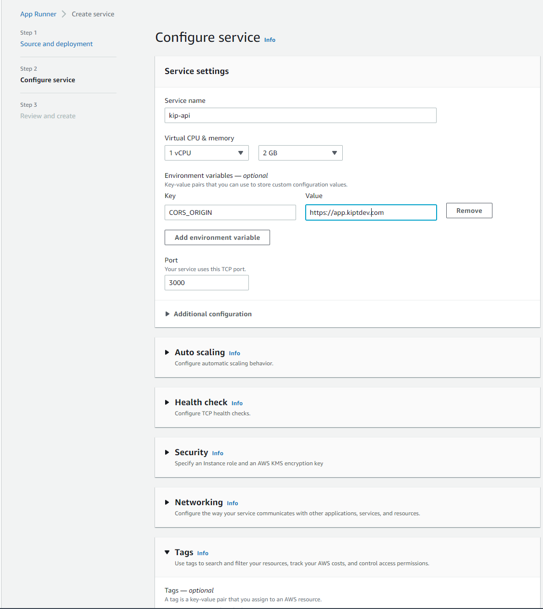
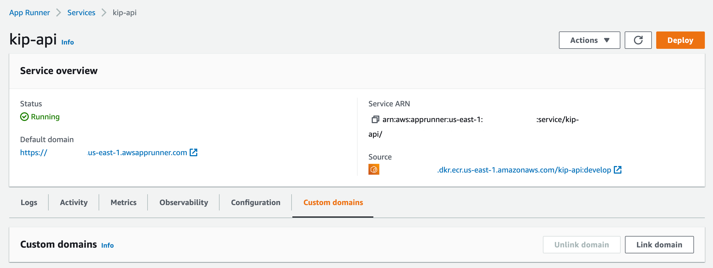
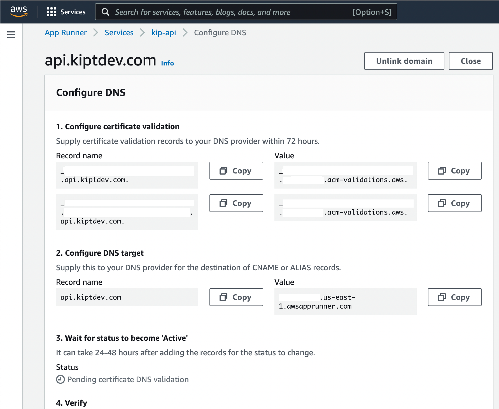
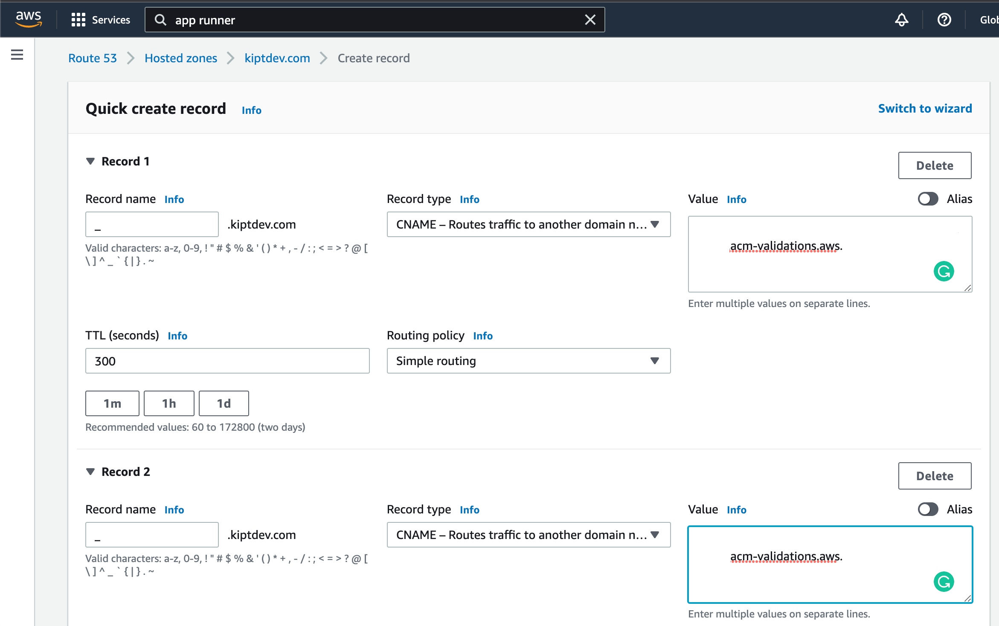
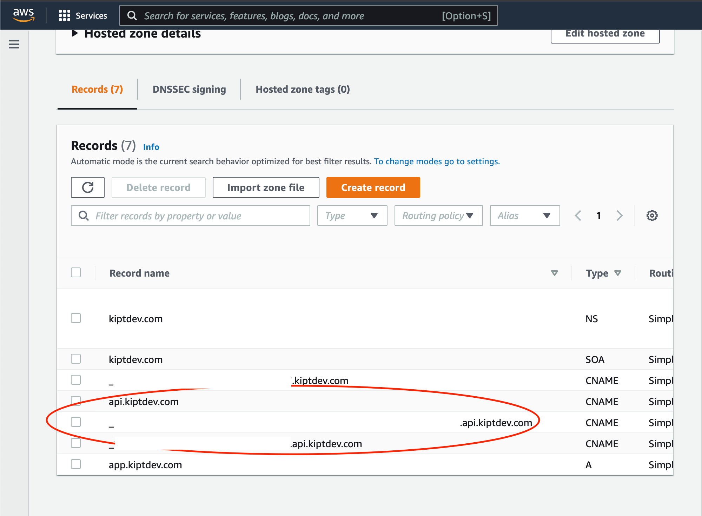

# App Runner

1. We create a service in app-runner with the ECR repository previously created.

2. Add the service name and environment variables, if necessary additional configurations.

## Custom Domain (Optional)

1. Go to the service settings, in the custom domains tab click on "link domain".

2. Enter your domain name.

3. Copy the records name and values from step 1.

4. Set this value in your domain provider.

Example [Route 53:](https://aws.amazon.com/es/route53/)

1. Create a record in your Route 53 hosted zone:

2. Set the CNAMEs with the name of the records and the previous values obtained.

3. Verify new records.

