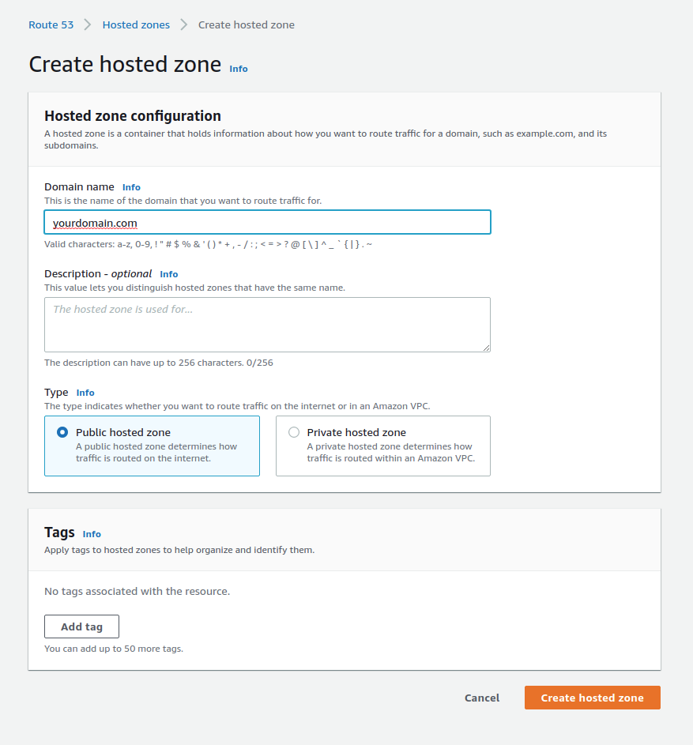

# Create Hosted Zone

When we already have a domain in a service provider like GoDaddy and we want to manage it via AWS we need to set it up using `Route53`. Route53 is AWS' premium DNS service and it integrates directly into all AWS services making it very convenient to work with.

To start working with Route 53 first, we need to navigate to this service.

Once we’re inside Route53 we need to create a new Hosted Zone, this is how Route53 calls our domains. To do this we can click on `Create hosted zone`

In the process of creating a new hosted zone we need to type the domain name without any protocols, so in our example we have `yourdomain.com` . Now we need to setup the type of hosted zone, for any public domain we will be using `Public hosted zone`. Private zones are rarely used and should only be used if your project requires it.

After we’ve defined this properties we can go ahead and click on `Create hosted zone`.

With the newly created hosted we can now see some initial records created, primarily Nameservers, we’ll be using this shortly as our domain is not really connected to AWS yet. 

For now we will assume that the domain that has just been created was already setup in another service like GoDaddy and has some DNS records that need to be migrated, if that’s not the case you can skip ahead to the next section. To start this process we need to export the DNS records from our current DNS service provider. In the case of go daddy follow [this instructions](https://www.google.com/search?q=godaddy+export+dns+records&oq=godaddy+export+dns&aqs=chrome.0.0j69i57j0i22i30j69i64l2.3630j0j1&sourceid=chrome&ie=UTF-8). Every service provider will have an export function, and the output is a text file that we can import into AWS. To start this process click on `Import zone file` .

In the next sceen we need to copy the context of our txt file into the input for the zones file, take into consideration that you might need to change or remove some values depending on the DNS service provider that exported it. Route53 will log any errors when trying to import this file so you can follow the recommendations from the error messages.

Once we’re ready with the records we can click on `Import` to continue.

Now that we have out hosted zone created in AWS we need to set it up in our Registrar provider, in our example GoDaddy. With our hosted zone created we will now have Nameservers assigned to our domain by AWS and we need to set this up in our GoDaddy Account (Steps will be similar in different registrar providers).

Let’s go ahead and copy our name servers, as we’ll be using them in our registrar provider

Inside our registrar’s configurations we need to go into the settings for our domain and we want to change our Nameservers.

In the configurations we need to create a new record for each line of our Nameservers, note that we’re removing the `.` at the end of each record. This will vary depending on the Registrar configurations, some will require it and some don’t. Try saving each of the variants and most registrars will error out if they don’t accept the configuration. The vast majority of registrars will require it to be removed.

Once we’ve added all out Nameservers we can save the configurations.

This process usually takes about half an hour to process but it can take as long as 72 hours in some cases, it will vary between registrar providers. Once your registrar processes this changes the domain management will now be managed by Route53 in AWS and all updated and new records should be managed from AWS.
