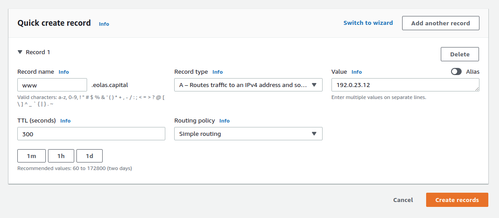

# Create/Update Record

Te create or update DNS records inside a Hosted Zone (Domain) first we need to navigate to Route53 and then select the hosted zone we want to work in.

## Create Record

To create a new DNS record in Route53 just click on `Create record`

In the next screen fill in the information about the record you want to create, here you have configurations for the record to be created, for a complete list of Record Types and their descriptions please see this [article](https://en.wikipedia.org/wiki/List_of_DNS_record_types). In most cases we will be creating either an A record or a CNAME record. When we’re referencing an AWS service in most cases we can use an `Alias` that will be registered as an A record. The configurations of your record will vary depending on the requirements for it, if you have questions on this please reach out to your Project Owner.

## Edit Record

To edit a record we’ll follow a very similar process to creating a new record, but with the key difference that we first need to select the record we want to edit and then we need to click on `Edit`. This will take us to the record editing screen for this record(s).

In the editing screen we can modify all the same values as when we create a new record, in case you have any questions please reference the record creation step.

