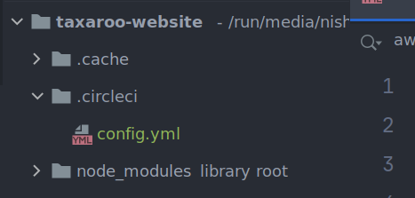
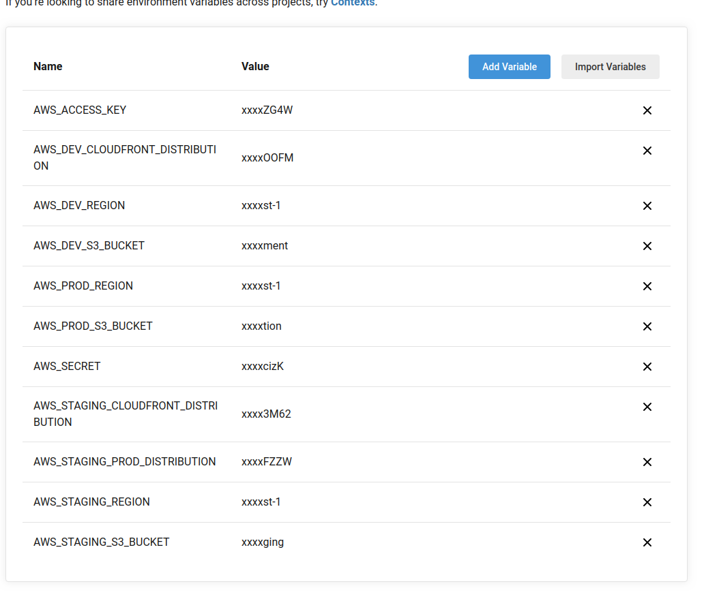
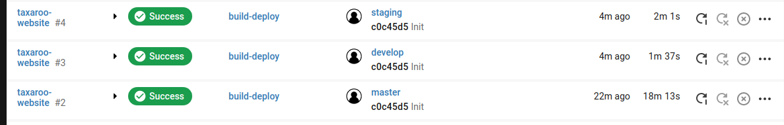

# Circle CI [FE]

## Circle CI Configuration

Once we have our environment setup we need to add CircleCI config files for our repository. Go ahead and create a new branch for this task and once you’re ready create a new folder at the root of the repository called `.circleci` and create a file inside called `config.yml`


The contents of this file will vary slightly depending on the requirements for the project, if we have staging environment or not and if we will have Carbon Builds or not.

Here’s the configuration file for a full setup with all 3 environments & Carbon Builds

> info
>
> ``` 
> # Javascript Node CircleCI 2.0 configuration file
> #
> # Check https://circleci.com/docs/2.0/language-javascript/ for more details
> #
> version: 2
> jobs:
>   DeployDev:
>     docker:
>       # specify the version you desire here
>       - image: nikolaik/python-nodejs:latest
>       # Specify service dependencies here if necessary
>       # CircleCI maintains a library of pre-built images
>       # documented at https://circleci.com/docs/2.0/circleci-images/
>       # - image: circleci/mongo:3.4.4
>     working_directory: ~/repo
>     steps:
>       - checkout
>       - run:
>           name: Install AWS CLI
>           command: |
>             curl "https://awscli.amazonaws.com/awscli-exe-linux-x86_64.zip" -o "awscliv2.zip"
>             unzip awscliv2.zip
>             ./aws/install -i /usr/local/aws-cli -b /usr/local/bin
>             aws --version
>       - run:
>           name: Setup AWS credentials
>           command: |
>             mkdir ~/.aws
>             touch ~/.aws/config
>             chmod 600 ~/.aws/config
>             echo "[profile aws_profile]" > ~/.aws/config
>             echo "aws_access_key_id=${AWS_ACCESS_KEY}" >> ~/.aws/config
>             echo "aws_secret_access_key=${AWS_SECRET}" >> ~/.aws/config
>       # Download and cache dependencies
>       - restore_cache:
>           keys:
>             - v1-dependencies-{{ checksum "package.json" }}
>             # fallback to using the latest cache if no exact match is found
>             - v1-dependencies-
>       - run:
>           name: Install Dependencies
>           command: |
>             rm -rf node_modules
>             rm package-lock.json
>             yarn install
>       - save_cache:
>           paths:
>             - node_modules
>           key: v1-dependencies-{{ checksum "package.json" }}
>       # run tests!
>       # - run: yarn test
>       - run:
>           name: Build Application
>           command: |
>             CI=false yarn run build
>       - run:
>           name: Deploying to AWS S3
>           command: |
>             aws s3 sync public/ s3://${AWS_DEV_S3_BUCKET} --profile aws_profile --region ${AWS_DEV_REGION}
>       - run:
>           name: Invalidate Cloudfront Cache
>           command: |
>             aws cloudfront create-invalidation --distribution-id ${AWS_DEV_CLOUDFRONT_DISTRIBUTION} --paths "/*" --profile aws_profile
>   DeployStaging:
>     docker:
>       # specify the version you desire here
>       - image: node:10.15.0
>       # Specify service dependencies here if necessary
>       # CircleCI maintains a library of pre-built images
>       # documented at https://circleci.com/docs/2.0/circleci-images/
>       # - image: circleci/mongo:3.4.4
>     working_directory: ~/repo
>     steps:
>       - checkout
>       - run:
>           name: Install AWS CLI
>           command: |
>             apt-get update && apt-get install -y python-dev
>             curl -O https://bootstrap.pypa.io/get-pip.py
>             python get-pip.py
>             pip install awscli
>             aws --version
>       - run:
>           name: Setup AWS credentials
>           command: |
>             mkdir ~/.aws
>             touch ~/.aws/config
>             chmod 600 ~/.aws/config
>             echo "[profile aws_profile]" > ~/.aws/config
>             echo "aws_access_key_id=${AWS_ACCESS_KEY}" >> ~/.aws/config
>             echo "aws_secret_access_key=${AWS_SECRET}" >> ~/.aws/config
>       # Download and cache dependencies
>       - restore_cache:
>           keys:
>             - v1-dependencies-{{ checksum "package.json" }}
>             # fallback to using the latest cache if no exact match is found
>             - v1-dependencies-
>       - run:
>           name: Install Dependencies
>           command: |
>             rm -rf node_modules
>             rm package-lock.json
>             yarn install
>       - save_cache:
>           paths:
>             - node_modules
>           key: v1-dependencies-{{ checksum "package.json" }}
>       # run tests!
>       # - run: yarn test
>       - run:
>           name: Build Application
>           command: |
>             CI=false yarn run build
>       - run:
>           name: Deploying to AWS S3
>           command: |
>             aws s3 sync public/ s3://${AWS_STAGING_S3_BUCKET} --profile aws_profile --region ${AWS_STAGING_REGION}
>       - run:
>           name: Invalidate Cloudfront Cache
>           command: |
>             aws cloudfront create-invalidation --distribution-id ${AWS_STAGING_CLOUDFRONT_DISTRIBUTION} --paths "/*" --profile aws_profile
>   DeployProd:
>     docker:
>       # specify the version you desire here
>       - image: node:10.15.0
>       # Specify service dependencies here if necessary
>       # CircleCI maintains a library of pre-built images
>       # documented at https://circleci.com/docs/2.0/circleci-images/
>       # - image: circleci/mongo:3.4.4
>     working_directory: ~/repo
>     steps:
>       - checkout
>       - run:
>           name: Install AWS CLI
>           command: |
>             apt-get update && apt-get install -y python-dev
>             curl -O https://bootstrap.pypa.io/get-pip.py
>             python get-pip.py
>             pip install awscli
>             aws --version
>       - run:
>           name: Setup AWS credentials
>           command: |
>             mkdir ~/.aws
>             touch ~/.aws/config
>             chmod 600 ~/.aws/config
>             echo "[profile aws_profile]" > ~/.aws/config
>             echo "aws_access_key_id=${AWS_ACCESS_KEY}" >> ~/.aws/config
>             echo "aws_secret_access_key=${AWS_SECRET}" >> ~/.aws/config
>       # Download and cache dependencies
>       - restore_cache:
>           keys:
>             - v1-dependencies-{{ checksum "package.json" }}
>             # fallback to using the latest cache if no exact match is found
>             - v1-dependencies-
>       - run:
>           name: Install Dependencies
>           command: |
>             yarn install
>       - save_cache:
>           paths:
>             - node_modules
>           key: v1-dependencies-{{ checksum "package.json" }}
>       # run tests!
>       # - run: yarn test
>       - run:
>           name: Build Application
>           command: |
>             CI=false yarn run build
>       - run:
>           name: Deploying to AWS S3
>           command: |
>             aws s3 sync public/ s3://${AWS_PROD_S3_BUCKET} --profile aws_profile --region ${AWS_PROD_REGION}
>       - run:
>           name: Invalidate Cloudfront Cache
>           command: |
>             aws cloudfront create-invalidation --distribution-id ${AWS_STAGING_PROD_DISTRIBUTION} --paths "/*" --profile aws_profile
>   CarbonBuild:
>     docker:
>       # specify the version you desire here
>       - image: node:10.15.0
>       # Specify service dependencies here if necessary
>       # CircleCI maintains a library of pre-built images
>       # documented at https://circleci.com/docs/2.0/circleci-images/
>       # - image: circleci/mongo:3.4.4
>     working_directory: ~/repo
>     steps:
>       - checkout
>       - run:
>           name: Install AWS CLI
>           command: |
>             apt-get update && apt-get install -y python-dev
>             curl -O https://bootstrap.pypa.io/get-pip.py
>             python get-pip.py
>             pip install awscli
>             aws --version
>       - run:
>           name: Setup AWS credentials
>           command: |
>             mkdir ~/.aws
>             touch ~/.aws/config
>             chmod 600 ~/.aws/config
>             echo "[profile aws_profile]" > ~/.aws/config
>             echo "aws_access_key_id=${AWS_ACCESS_KEY}" >> ~/.aws/config
>             echo "aws_secret_access_key=${AWS_SECRET}" >> ~/.aws/config
>       - run:
>           name: Check ENV
>           command: |
>             printenv
>       # Download and cache dependencies
>       - restore_cache:
>           keys:
>             - v1-dependencies-{{ checksum "package.json" }}
>             # fallback to using the latest cache if no exact match is found
>             - v1-dependencies-
>       - run:
>           name: Install Dependencies
>           command: |
>             yarn install
>       - save_cache:
>           paths:
>             - node_modules
>           key: v1-dependencies-{{ checksum "package.json" }}
>       # run tests!
>       # - run: yarn test
>       - run:
>           name: Build Application
>           command: |
>             CI=false yarn run build
>       - run:
>           name: Deploying to AWS S3
>           command: |
>             aws s3 sync public/ s3://${AWS_DEV_S3_BUCKET} --profile aws_profile --region ${AWS_DEV_REGION}
>       - run:
>           name: Invalidate Cloudfront Cache
>           command: |
>             aws cloudfront create-invalidation --distribution-id ${AWS_DEV_CLOUDFRONT_DISTRIBUTION} --paths "/*" --profile aws_profile
> workflows:
>   version: 2
>   build-deploy:
>     jobs:
>       - CarbonBuild:
>           filters:
>             branches:
>               only:
>                 - /carbon/.*/
>       - DeployDev:
>           filters:
>             branches:
>               only:
>                 - develop
>       - DeployStaging:
>           filters:
>             branches:
>               only:
>                 - staging
>       - DeployProd:
>           requires:
>             - hold
>           filters:
>             branches:
>               only:
>                 - master
>       - hold:
>           type: approval
>           filters:
>             branches:
>               only:
>                 - master
> ```

This file contains the following jobs:

- DeployDev
- DeployStaging
- DeployProd
- CarbonBuild

If any of this needs to be removed the `workflows` sections will need to be updated accordingly.

> Please note that in the step `Deploying to AWS S3` we’re running the following command:
> `s3 sync public/`
> this assumes that your built project is located in the folder `./public/` in some projects like a Gatsby project the build folder might differ and this path will need to be adjusted in all the jobs that have this command.


After we’ve done this, we will now need to push our code into our branch.

## CircleCI Setup

The next step is setting up CircleCI to build the project for this you’ll need the CircleCI administrator to set up the build process for this repo.

Once the project is set up by your administrator, you need to set up the project’s environment variables inside CircleCI. You can see that in our `config.yml` we have a couple of variables represented by `${MY_VARIABLE}` and we need to create this value.

We now need to go into the project’s settings inside CircleCI and into `Environment Variables` where we need to set up values for the following:

- `AWS_ACCESS_KEY`
- `AWS_SECRET`
- `AWS_DEV_S3_BUCKET`
- `AWS_DEV_REGION`
- `AWS_DEV_CLOUDFRONT_DISTRIBUTION`
- `AWS_STAGING_S3_BUCKET`
- `AWS_STAGING_REGION`
- `AWS_STAGING_CLOUDFRONT_DISTRIBUTION`
- `AWS_PROD_S3_BUCKET`
- `AWS_PROD_REGION`
- `AWS_PROD_CLOUDFRONT_DISTRIBUTION`

Here the credentials for `AWS_ACCESS_KEY` and `AWS_SECRET` will most likely need to be provided by the project’s DevOps admin. From here we will want to add the S3 bucket name, AWS region and corresponding Cloudfront distribution ID. In our case for development it would look something like this:

- `AWS_DEV_S3_BUCKET`= `taxaroo-website-development`
- `AWS_DEV_REGION =` `us-east-1`
- `AWS_DEV_CLOUDFRONT_DISTRIBUTION =` `E381Y7SCQEOOFM`

The final configuration should look something like this:


Once we have this we want to test our new environments.

## Testing Environments

Now that we have all our environments in AWS and our configurations in CircleCI we need to test them, we can now merge our CI branch into develop and monitor the deployment. This should happen automatically, if this happens correctly we want to merge now to staging and finally if requested into master. Take note that master requires a manual authorization for the deployment to go thru.

If all went well we should see something like this under CircleCI’s pipelines for our repository:

