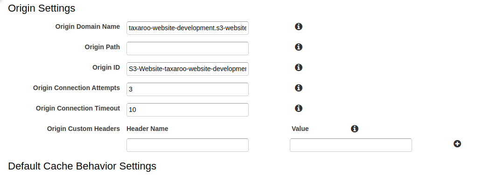
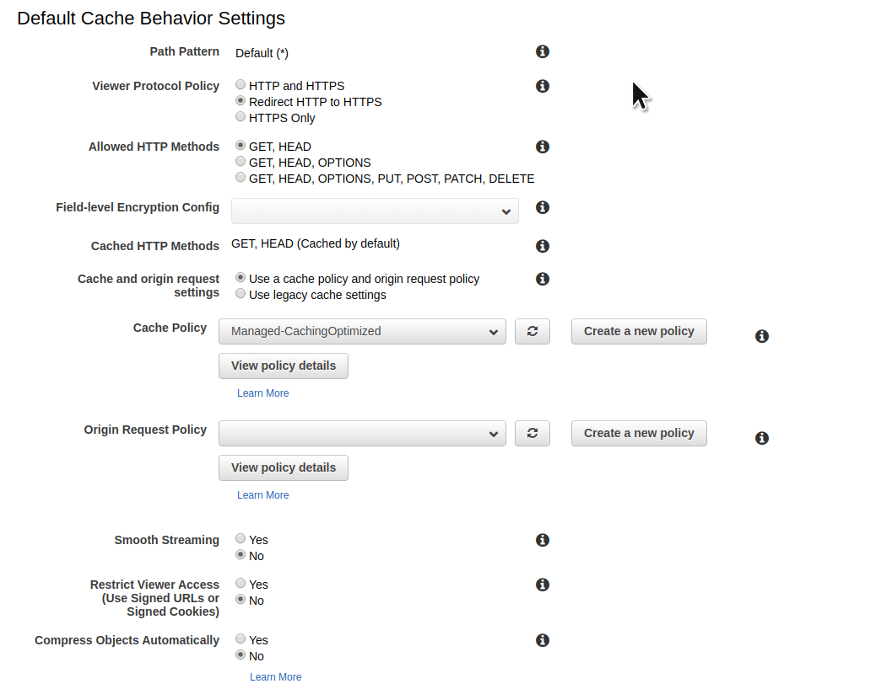
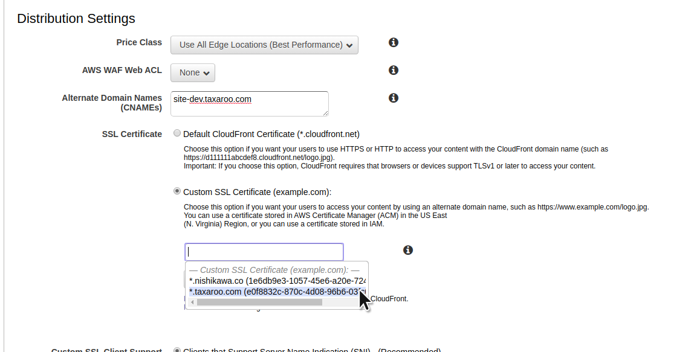
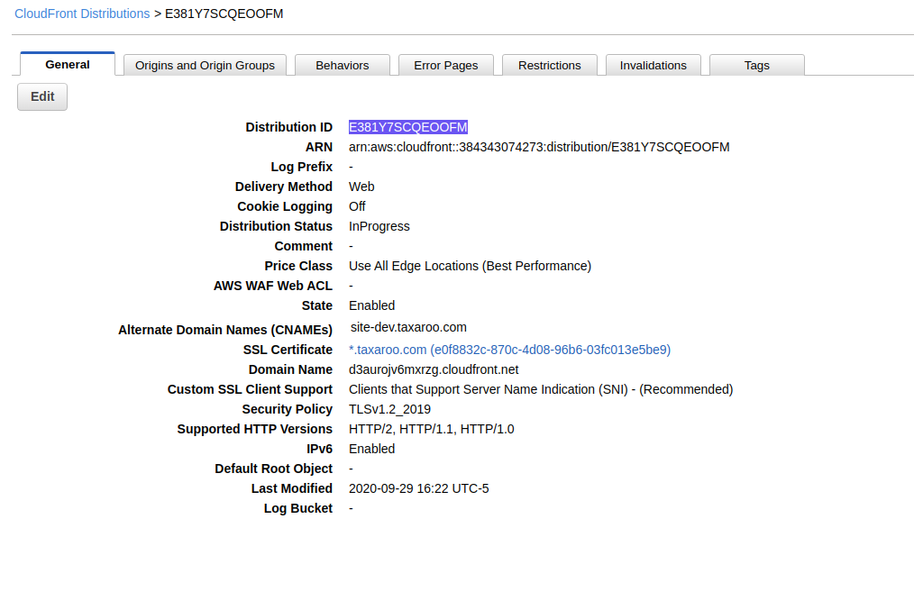

# Cloudfront Configuration

Inside Cloudfront we wan to start creating a new distribution, take in mind that at this point we will assume you already have an AWS ACM SSL certificate and a domain on Route53 where we can wire things up.

So in this configuration on the value for `Origin Domain Name` we’ll add the value of our previous S3 website hosting endpoint.

Then, we want to setup the `Viewer Protocol Policy` to `Redirect HTTP to HTTPS`

Now for the `Distribution Settings` we are going to set up our SSL certificate & CNAMEs for this deployment. Under `Alternate Domain Names (CNAMEs)` we want to enter our URL for this deployment in our example it being `site-dev.taxaroo.com`.

Then we want to click on `Custom SSL Certificate (example.com)` and this will enable an input where we can select the SSL certificate we want to use.

All the remaining settings we want to leave them in their default setup and at this point we can go ahead and create our distribution.

Now that we’ve created out Distribution, we want to make note of the Distribution ID and out Domain Name (In our case: `d3aurojv6mxrzg.cloudfront.net`) as we will be using this at a later stage.

