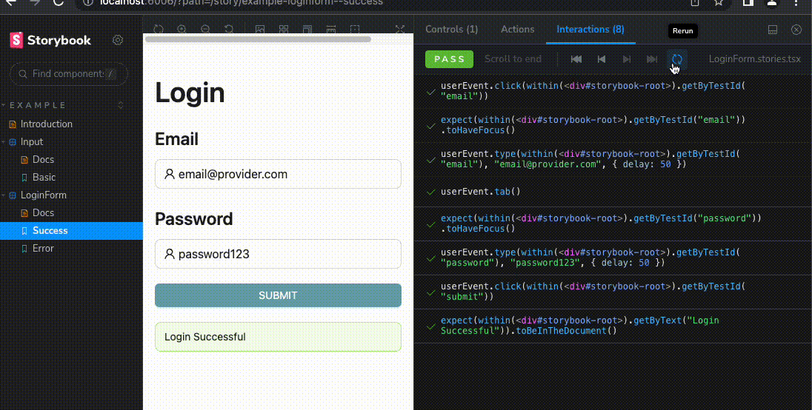
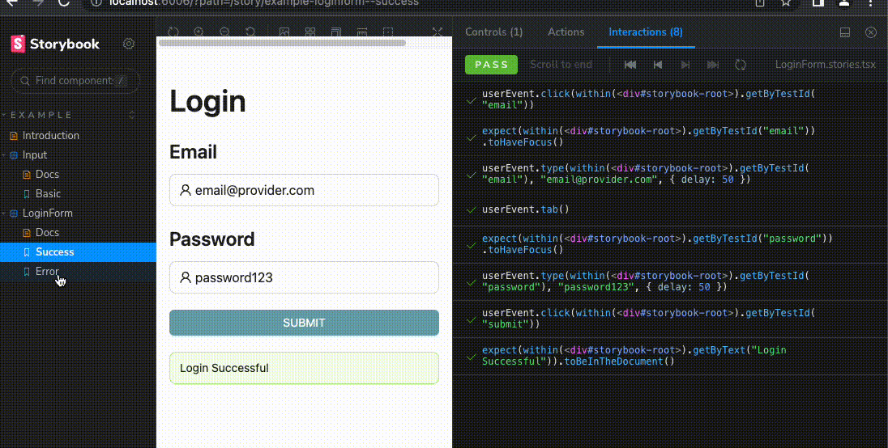

# Interaction Tests

Interaction tests allow you to** verify functional aspects of UIs**.

In a nutshell, there are 3 stages for this:

1. You start by supplying the appropriate props for the initial state of a component. 
2. Then, you simulate user behavior such as clicks and form entries. 
3. Finally, you check whether the UI and component state update correctly.

## Addons Needed

`@storybook/addon-interactions` 

Visualizes the test in Storybook and provides a playback interface for convenient browser-based debugging.

## Setup

Run the following command to install the interactions addon and related dependencies.

```powershell 
npm install @storybook/testing-library @storybook/jest @storybook/addon-interactions --save-dev
```

Update your Storybook configuration (in `.storybook/main.js|ts`) to include the interactions addon.

```typescript 
// .storybook/main.ts

// Replace your-framework with the framework you are using (e.g., react-webpack5, vue3-vite)
import type { StorybookConfig } from '@storybook/your-framework';

const config: StorybookConfig = {
  framework: '@storybook/your-framework',
  stories: ['../src/**/*.mdx', '../src/**/*.stories.@(js|jsx|ts|tsx)'],
  addons: [
    // Other Storybook addons
    '@storybook/addon-interactions', // 👈 Register the addon
  ],
};

export default config;

```


## Now, let’s write an interaction test!

In this example we are using [And Design](https://ant.design/components/overview/) as our base components but you can create your own as you wish.

Let’s start by creating a simple Input component

Input.tsx

```typescript 
import React, { FC } from "react";
import { Input as AntdInput, Typography, InputProps as AntdInputProps } from "antd";
import { UserOutlined } from "@ant-design/icons";

const { Title, Text } = Typography;

export interface InputProps extends AntdInputProps {
  label?: string;
  required?: boolean;
  error?: string;
}

export const Input: FC<InputProps> = ({ label, placeholder, id, error, onChange }) => (
  <div>
    {label && <Title level={3}>{label}</Title>}
    <AntdInput
      id={id}
      size="large"
      data-testid={id}
      onChange={onChange}
      prefix={<UserOutlined />}
      placeholder={placeholder}
      status={error ? "error" : ""}
    />
    {error && <Text type="danger">{error}</Text>}
  </div>
);


```

And then creating its respective story.

Input.stories.tsx

```typescript 
import type { Meta, StoryObj } from "@storybook/react";
import { within, userEvent } from "@storybook/testing-library";
import { Input } from "../../src/components";
import { expect } from "@storybook/jest";

const meta = {
  title: "Example/Input",
  component: Input,
  tags: ["autodocs"],
  argTypes: {},
} satisfies Meta<typeof Input>;

export default meta;
type Story = StoryObj<typeof meta>;

export const Basic: Story = {
  args: {
    label: "Email",
    placeholder: "example@mail.com",
    id: "email",
    required: true,
  }
};

```

You should be seeing something like this: 


Now that the basics are pretty much done let’s begin with the interesting part, the testing.

This is where we are going to make use of our `play` function (mentioned earlier in our [concepts-you-should-now-about](../storybook-testing/concepts-you-should-now-about.md))

Let’s grab the `args` code section in our Story and write our tests with `@storybook/testing-library`

**In this example we are going to be testing: **

1. The Input to have `focus` when clicked
2. The Input to correctly perform it’s `onChange` functionality.

```typescript 
...
export const Basic: Story = {
  args: {
    label: "Email",
    placeholder: "example@mail.com",
    id: "email",
    required: true,
  },
  play: async ({ canvasElement }) => {
    const canvas = within(canvasElement);

    userEvent.click(canvas.getByTestId("email"));
    expect(canvas.getByTestId("email")).toHaveFocus();

    // 👇 Simulate interactions with the component
    userEvent.type(canvas.getByTestId("email"), "email@provider.com", {
      delay: 50,
    });
  },
};
```

> As you can see we are making of use of the `delay` option for our simulated interaction, this makes typing a series of characters to be delayed per `setTimeout` for (at least) `delay` seconds, which is really cool, cause now you can see something like this: 


Simple and really cool, isn’t it?

We can make more tests like Success and Error states in a Login form, for example.



> If you would like to see this full example you can take a look at our [usage-example](../storybook-testing/usage-example.md) 
