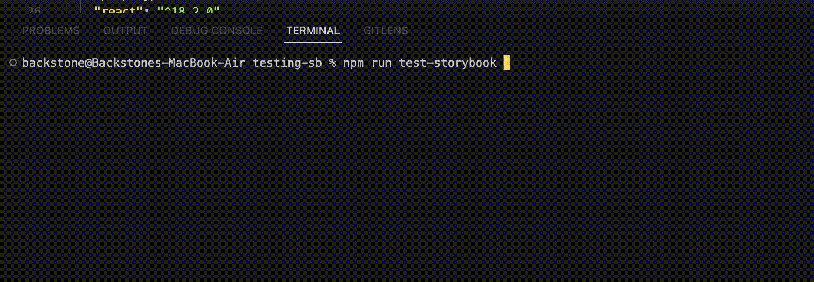

# Test Runner

<sub>Powered by </sub>[<sub>Jest</sub>](https://jestjs.io/)<sub> and </sub>[<sub>Playwright</sub>](https://playwright.dev/)<sub>.</sub>

The test-runner is a standalone, framework-agnostic utility that** runs parallel to your Storybook, **it turns all of your stories into executable tests and **it can be executed via the **[**command line**](https://storybook.js.org/docs/react/writing-tests/test-runner#cli-options)** or your **[**CI server**](https://storybook.js.org/docs/react/writing-tests/test-runner#set-up-ci-to-run-tests)**. **

## Setup

Install dependencies

```powershell 
npm install @storybook/test-runner --save-dev
```

Update your `package.json` scripts and enable the test runner.

```powershell 
{
  "scripts": {
    "test-storybook": "test-storybook"
  }
}
```

Before running your tests make sure your storybook is running! 

```powershell 
npm run storybook
```

Now you can open a new terminal window and run the test-runner with:

```powershell 
npm run test-storybook
```



