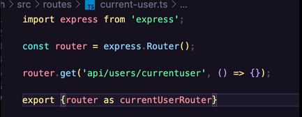
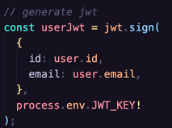

# Architecture of multi-service app

_Ticketing app (Full documented)_

## 1. We will first begin with the Authentication service.

Project Directory > Auth directory > Create package.json with

        npm init -y

Install some dependencies

        npm i typescript ts-node-dev express @types/express

Init a tsconfig file

        Tsc –init

Basic syntax/imports to get our express app up and running

src/index.ts

Make a start script in our package.json

> ts-node-dev restarts target node process when any of required files changes (as standard node-dev) but shares TS compilation process between restarts.

To build and image out of this we create a Docker File

We don't wanna load node_modules.

> In .dockerignore > node_modules

We build that image with

        Docker build -t user_name/name_of_image .

## 2. Run Image in Kubernetes cluster

Every time we make a deployment we want to create a service with it, it gives us access to a pod

pod

service

Before anything else we are going to add **Skaffold** to it.

In our root project directory > skaffold.yaml

        skaffold dev

We are gonna do some testing and add a route handler for our users

But first we are gonna add **configuration roles** to ingress nginx

The next step is to configure our host route, everytime we want to navigate to ticketing.dev we are going to tell our computer to navigate to the local host instead.

_Code /etc/hosts_

You shuold see something like this

Then, We are going to make a small change in the route handlers, this is only to create a more organized and easy to understand code, we are going to create routers for **EACH** route.

At this point we are going to end up having something like this:

## 3. Signup Method

We are going to use an external library for validation. **express-validator**. (AMAZING)

> **A QUICK REMINDER RIGHT HERE:**
> We need to make sure that every case of response inside this route has the same structure, so it doesn’t become a problem to handle in the front end application.

## 4. Error Handling

- We can create an error handling middleware to process errors, give them structure, and send them back to the browser.
- We need to make sure to capture all possible errors by calling express’s ‘next’ function

### Setup the middleware

1. Create the middleware itself.

2. Use it in index.js.

3. Evry time ypu throw an error the app is going to use that error handler.

### Customize error message

For this we are going to use err.message instead,

but where does the message come from?

**Everytime we throw a new Error the text passed to is assigned to the “message” property.**

To make this even better we are going to create instance objects to handle each type of error like connection to the DB or wrong credentials.

Like so:

| Example 1                     | Example 2                     | Usage                         |
| ----------------------------- | ----------------------------- | ----------------------------- |
|  |  |  |

**Now that the error objects are created:**

We are going to handle the type of tghe errors inside the error handler.

**But yes, this is not efficient enough.**

We are going to create a solid abstract class, ‘CustomError,’ which is going to tell every custom error class to have certain properties.

- Base custom class

- Usage Example

- Final Error handler

> Interface example:

### Route Error Handling

- Error class

- Usage

> **NOTE:** To make this error handler async, we can use the ‘Next’ function from express, or add express-async-errors.

## 5. Data Management and modeling

Install mongoose in our auth project directory, a library used to get access to mongoDB

                npm i mongoose @types/mongoose

Our MongoDB instance is going to be inside another pod, so we need to create a cluster IP service for this as well.

> NOTE: At this point if we delete or restart this pod all the data is going to be lost.
> Connect the DB to the app.

We are going to wrap all up into a function, only if the connection is successful it will run the app.

                URL TO DB: mongodb//name_of_db_service:port/name_of_collection

### User Creation

> **It is important to create typings for everything.**
> Object attributes, object model, object document.

Then you can create a schema, build method and the model itself.

And then, we can make use of this.

| User Email Validation         | User Creation                 |
| ----------------------------- | ----------------------------- |
|  |  |

### Password hashing

1.Create a new class specifically for handling password hashing.

> NOTE: Static methods are the ones that can be accessed without creating a new instance of a class.

Hashing function

Comparing function

2. Saving a hashed password.

Every Time a **user is created in signup** mongoose is going to call a middleware function to hash the given password.

The password will only be hashed when modified (updated or created).
The password will not be hashed when Login

## 6. Authentication Strategies and Options

The best option chosen for this example project was to tell each individual service how to authenticate an user. If the Auth service is down it won't really matter.

### COOKIE VS JWT

- **Cookie:** is a piece of whatever information stored by the web browser that can be used as a header in server requests, for example.
- **JWT:** Is created from payload information encoded with some JWT Algorithm. This means that information can be extracted from this encoded string. It can be used as an Authorization header, as part of the body of a request or, it can be also stored as a cookie and managed by our web browser and used in every following request.

SELECTED APPROACH

**Hide our JWT inside our cookie and get the necessary information from it.**
For this we are going to use cookie-session.

https://www.npmjs.com/package/cookie-session

A user session can be stored in two main ways with cookies: **on the server or on the client.**

This module stores the session data on the client within a cookie, while a module like express-session stores only a session identifier on the client within a cookie and stores the session data on the server, typically in a database.

### 1. Cookie-session configuration

Points to be consider:

- Traffic is being ‘Proxied’ to our app through Nginx.
- Express is not going to trust in that HTTPS connection.
- We need to make sure that that traffic can be trusted even though it is coming from a proxy.

Example

> NOTE: PROXY DEFINITION  
> A proxy server is a server that does something on your behalf. Connected with the web, you have two different definitions.   > **A forward proxy:** Hides the identity of the clients.  > **A reverse proxy:** Hides the identity of the server.

### 2. Generating our JWT

We need to install **jsonwebtoken**.

https://www.npmjs.com/package/jsonwebtoken

There are 2 methods we are going to use with this library:

A) **jwt.sign(payload, secretOrPrivateKey, [options, callback]):**

It generates the JWT and the payload is the data we want to store inside of it.

B) **jwt.verify(token, secretOrPublicKey, [options, callback]):**

It is used to get that payload out from the jwt and to make sure we can't mess around with it.

Generate JWT

Sotre it in session

That JWT is going to be stored encrypted as so:

- It is a Base64 string
- It needs to be decoded to get the JWT.
- That JWT can be decoded later on to get the user information stored in it.
- The signing key (in this example “asdf”) is used to verify that the JWT has not been messed with.
- and we are going to be using it on each service to make sure the JWT is a valid token.

### 3. Making our signing key more secure

The point is to take that signing key and make it a ‘Secret’ with:

                Kubectl create secret generic name-of-secret —from-literal=name_of_key=key

This command creates an object

                k create secret generic jwt-secret --from-literal=JWT_KEY=asdf

NOW, we are going to provide each of our pods with that secret through **Env variables**.

Assign a secret to the auth pod (auth-depl.yaml)

> NOTE: If you try to assign a secret-name that does not exists, skaffold will not run the pod.

### 4. Implementing a Secret

That secret, our JWT_KEY, is going to be stored in our Env Variables as we said before, and we are gonna call it as our signing key when generating our JWT token as so:

**Hey, but what if we forget to define that JWT_KEY in our deployment file? No problem, let's make an error.**

### 5. Making Common Responses

You can come across a situation where your different services can have different implementations, like Ruby on Rails, Java Spring, etc, and different databases as well. So, this would imply the possibility of having different responses from each service.

Now, we are going to convert our response to a JSON object through our **user schema** (not very implemented tho, to do it there) but, we are gonna be using the toJSON method.

Our new **user schema** is going to look something like this.

What **toJSON** does is when you try to stringify an object, rather than convert the entire object, toJSON() is going to return the values indicated inside it.

Like in the example, it is transforming the object into our desired response.

| Prev response                 | New response                  |
| ----------------------------- | ----------------------------- |
|  |  |

### 6. Common Request Validation Middleware

To avoid typing multiple times the same validationResult of the validations of each route, we are going to create a middleware for this.

Once used in our **signup and signin method** we can continue to complete our singing method.

Once the credentials are valid the next steps are:

- Check if the user is existent
- Check if the passwords match
- Generate a new JWT
- Store it as a cookie

### 7. Handling Current User

It will all depend on if the req.session.jwt is set.

So, current user route, is going to check that session (saved when login/signup) and get the payload from the JWT (if it exists) using

                jwt.verify(token,process.env.JWT_KEY)

> NOTE: Every time a cookie is stored in Postman, it is going to save it for every following request.

### 8. Signout Method

Basically, we are going to send back a header that tells the user browser to empty all information inside of the user's cookie.

And literally it is just emptying the req.session

### 9. Current User Middlewares

The next step is to create 2 middlewares:

1. To extract the JWT payload and set it on req.currentUser.
2. To reject requests if the user is not logged in.

#### Current User Middleware

1. If there is no session or JWT, return next() so the next middleware can be executed.
2. If there is a session / JW, T assign the payload to req.currentUser

> **NOTE:** Typescript being typescript is going to create an error because the Request interface doesn't have a “currentUser” property.

3. Modify that existing interface by using this incredible method I didn’t know about

4. And last but not least, we are always going to continue to the next middleware with next();

#### Rquired Auth Middleware

This one is just going to return an error if the user is not set in **req.currentUser**, and it’s going to continue to the next middleware.

Also, we created another custom error with the **CustomError** class we already had.

