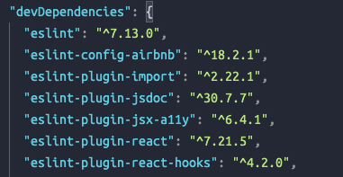
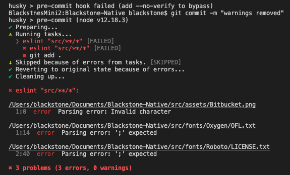

# ESLint Setup

For setting up ESLint on a new project we have to execute `npx` to run Blackstone’s custom eslint install.

Run `npx @blackstonestudio/eslint-config-blackstone` and follow the instructions.

We need to uninstall our current eslint packages.

First of all we need to run (on our project’s root directory) the following command:

`rm -rf node_modules/ package-lock.json .eslintrc`

Then we’ll go to our package.json and locate either on `dependencies` or `devDependencies` all of our installed eslint packages and delete them. 👉

Then we will save the file and proceed to reinstall node_modules. After the installation is finished we'll run the needed Blackstone’s eslint setup for our project.

If this is the case, we are going to need a `.eslintignore` file and write down all the conflicting file extensions, ie: 

`*.png, *.ttf, *.svg,` and so on.

